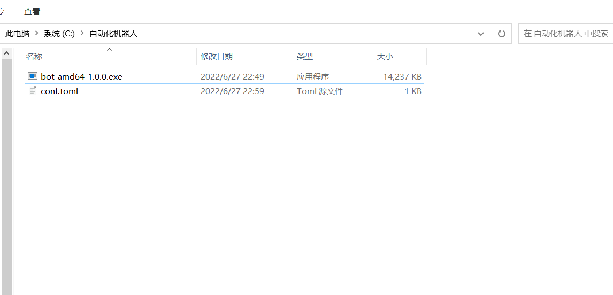
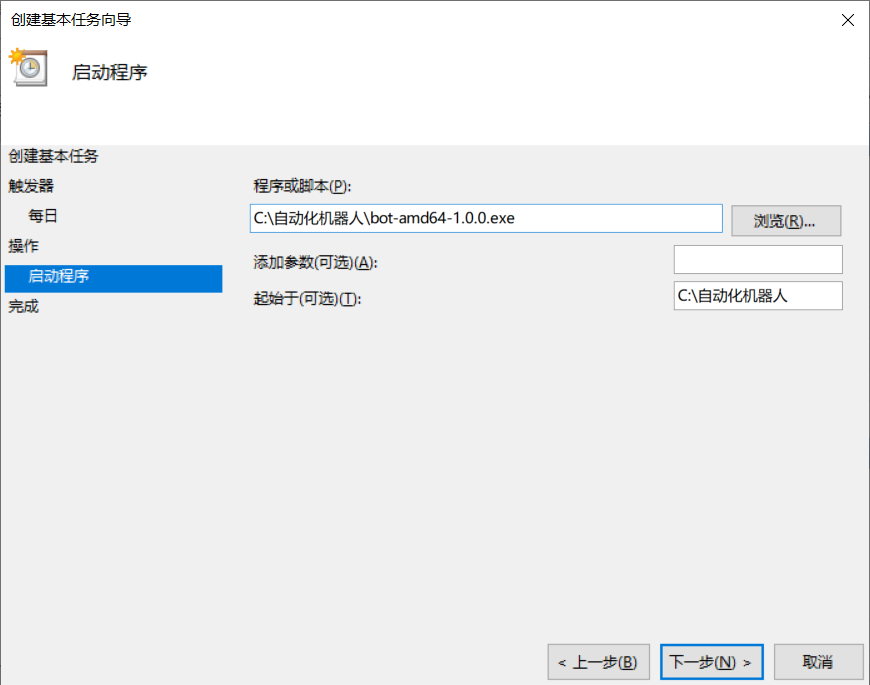
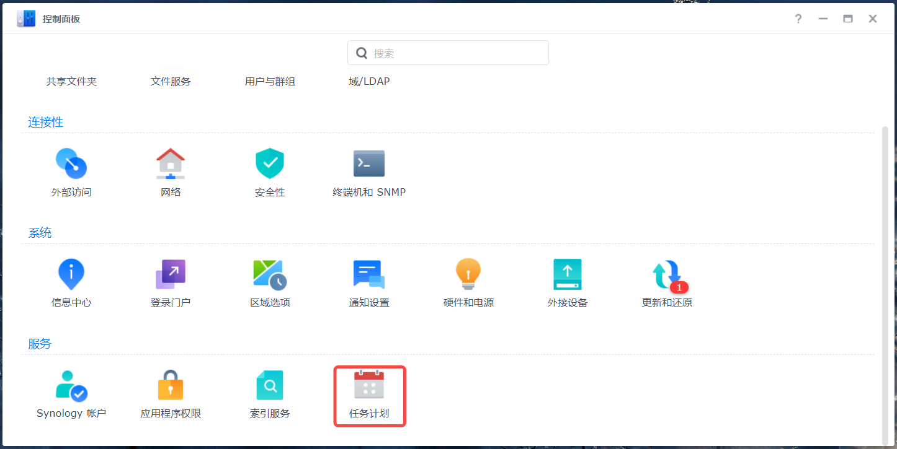
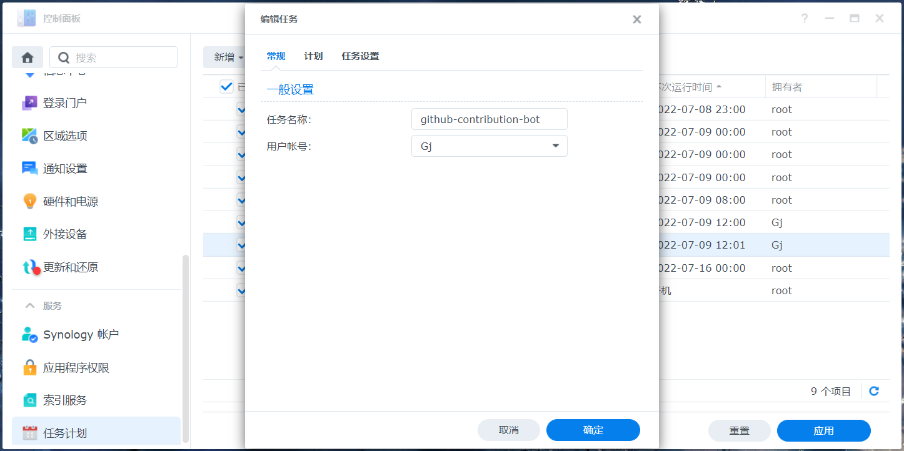

# 一个自动更新贡献度的机器人

:alembic: 此项目纯属自娱自乐

无需 Git 环境，通过预设的代码仓库，定期自动化提交 commit，来达到个人贡献度的更新。

## 使用方式

```shell
# 运行方式
# 配置文件[conf.toml]
$ bot-linux-amd64-1.0.2
# 指定配置文件
$ bot-linux-amd64-1.0.2 -c github.toml
```

通过定时任务方式，可用在 Nas、软路由、服务器或者个人 PC 等任意有网的设备上使用

[执行文件下载](https://github.com/g0ngjie/auto-contribution-bot/releases/tag/v1.0.0)

## conf.toml

> 配置文件，与执行文件放到同级目录下

```toml
# 是否新增文件，默认为false
# 非新增，则在执行文件中添加新的行
new_file = false
# 文件类型，默认为 md （值需要设置目标文件的后缀名）
file_type = "md"
# 内容来源
# 可选值：0：默认读取new_content 1：一言
content_from = 1
# 新增内容，默认为 YYYY-MM-DD
new_content = ""
# git仓库地址
# 注* https 方式
git_url = "https://gitee.com/g0ngjie/test-auto-contribution-bot.git"
# git仓库登录用户名
git_user = "<username>"
# git仓库登录密码
# 需要注意的是,如果你的仓库托管在github上,git_pass则为 Personal access tokens (访问令牌)
git_pass = "<password>"
# git邮箱，如果登录用户名为邮箱登录，则一致
# 邮箱如果不填写，贡献度将无法更新
git_email = "<email>"
```

## window 计划任务

这里以 window 的**任务计划程序**为例

1. 将我们**可执行文件** 以及 **配置文件** 放到指定目录下
   

2. 创建基本任务

   > 依次填写需要的配置的参数，以及触发条件。这样你的代码仓库就会按照预期计划自动更新。

   

## Nas 计划任务

> 通过系统自带的计划任务，执行二进制文件




